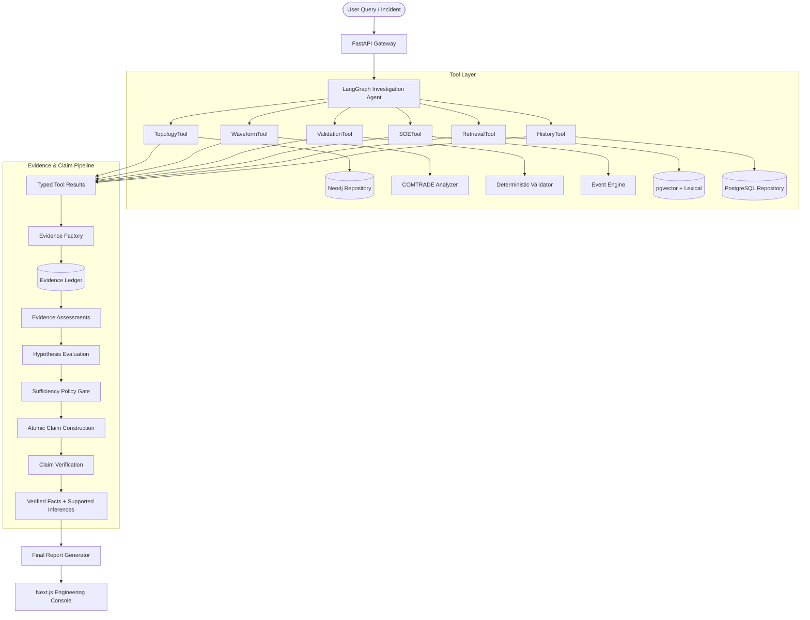

# GridLens: Agentic Power-System Event Investigation & Engineering Copilot
## Final Frozen Architectural Design Review

This document represents the frozen architectural specification for GridLens. It guarantees a deeply constrained, highly traceable engineering investigation system built upon deterministic evidence, explicit inference, contradiction lifecycles, and context-aware abstention.

---

### 1. Conceptual Architecture & Orchestration Flow

---

### 2. The Six Semantic Layers

Every diagnosis passes through exactly six layers of provenance. 

#### Layer 1: Authoritative Source
*   **What it is:** The physical/domain ground truth.
*   **Examples:** `.CFG`/`.DAT` COMTRADE files, Neo4j Graph configuration, Technical PDF Manuals.

#### Layer 2: Typed Tool Result
*   **What it is:** A strict code boundary ensuring data is deterministically extracted, not parsed by the LLM.
*   **Examples:** `ComtradeAnalysisResult`, `TopologyQueryResult`, `ValidationResult`.

#### Layer 3: Evidence Object
*   **What it is:** The atomic building block of investigation. Raw facts, completely decoupled from hypotheses.
*   **Structure:** `evidence_id`, `source_type`, `source_id`, `tool_name`, `fact`, `structured_value`, `unit`, `timestamp`, `provenance`, `deterministic`.

#### Layer 4: Evidence Assessment
*   **What it is:** Explicitly maps how an Evidence fact relates to a specific Candidate Hypothesis.
*   **Structure:** `assessment_id`, `evidence_id`, `hypothesis_id`, `relationship` (`SUPPORTS`, `CONTRADICTS`, `NEUTRAL`), `weight`, `rule_id`, `explanation`.

#### Layer 5: Hypothesis / Claim
*   **Hypothesis:** Evaluated mathematically via the weights in its `EvidenceAssessment`s. (No arbitrary LLM probabilities).
*   **Claim:** An atomic statement comprising the final report. Types include `FACT`, `INFERENCE`, `RECOMMENDATION`.

#### Layer 6: Verification & Final Report
*   **Verification:** Checks each Claim. `FACT`s must exactly match the Typed Tool Result. `INFERENCE`s must point to verified premises.
*   **Report:** Generated strictly from the `VERIFIED` and `SUPPORTED_INFERENCE` ledger entries.

---

### 3. Component Details & Design Contracts

#### Tools vs. Repositories
*   **Why it exists:** Distinguishes algorithmic extraction (Tools) from data storage abstraction (Repositories).
*   **Mechanism:** `WaveformTool` wraps the `COMTRADE Analyzer`. `TopologyTool` wraps the `Neo4j Repository`. 
*   **Rule:** Repositories only abstract DB calls. Tools return typed application responses. 

#### Context-Aware Sufficiency Gate
*   **Why it exists:** Abstains from guessing when required evidence is missing (e.g., Incident C).
*   **Mechanism:** `InvestigationType` $\rightarrow$ `EvidenceRequirementPolicy`. A topology question requires graph data. A trip investigation requires waveform, SOE logs, and topology.
*   **Output:** Allows investigation to proceed or explicitly halts with `INSUFFICIENT EVIDENCE`.

#### Conflict Lifecycle
*   **Why it exists:** Ensures discrepancies between authoritative sources (e.g., Relay says Phase A, COMTRADE says Phase C) are handled rigorously, not ignored (Incident B).
*   **Lifecycle:** `NO_CONFLICT` $\rightarrow$ `CONFLICT_DETECTED` $\rightarrow$ `INVESTIGATION` $\rightarrow$ `CONFLICT_RESOLVED` (e.g., wiring swap found) OR `CONFLICT_UNRESOLVED` (halt/abstain).

#### Claim Verification Guarantee
*   **Why it exists:** Enforces strict semantics for presentation. 
*   **FACT:** Directly observable/derived $\rightarrow$ verified against authoritative source.
*   **INFERENCE:** Derived from verified facts $\rightarrow$ marked `SUPPORTED_INFERENCE`, referencing premises.
*   **RECOMMENDATION:** Suggested next step $\rightarrow$ never presented as an observed fact.
*   **Rule:** The Verifier NEVER rewrites facts. It only marks `VERIFIED`, `REJECTED`, or `CONFLICTED`.

---

### 4. Failure Modes & Testing

*   **Tool Failure:** Infrastructure unavailable (e.g., Graph DB down). System explicitly reports unavailable evidence; LLM does NOT guess.
*   **Missing Data:** File truncated or config missing. Triggers Contextual Sufficiency Gate $\rightarrow$ `INSUFFICIENT EVIDENCE`.
*   **Testing Strategy:** 60-100 deterministic golden test cases spanning QA, waveform analysis, validation, timeline reconstruction, and abstention (negative cases). Baseline testing against Naive RAG to prove the absolute necessity of the deterministic tool layer.

---

### 5. Final Acceptance Criterion & Interview Defensibility

The final architecture is accepted if an interviewer can inspect a single F12 investigation and physically trace:

`Final sentence` $\rightarrow$ `claim` $\rightarrow$ `verified fact / supported inference` $\rightarrow$ `evidence` $\rightarrow$ `evidence assessment / inference rule` $\rightarrow$ `typed tool result` $\rightarrow$ `authoritative source`

The interviewer must also be able to visually observe:
*   Why each tool was selected.
*   What evidence supported/contradicted competing hypotheses.
*   Why the sufficiency policy allowed or rejected the diagnosis.
*   Which conflicts were resolved or remained unresolved.
*   Where the system would properly abstain. 

**Q: "How do you prevent the LLM from hallucinating the current?"**
A: "The LLM never computes current. The COMTRADE analyzer does. The resulting numerical fact is stored as evidence and verified against the analyzer output before it can appear as a fact in the final report."

**Q: "What happens when the relay says Phase A but the waveform says Phase C?"**
A: "The system records a conflict, investigates the relevant channel/configuration mappings, and either resolves the conflict with additional evidence or abstains if it remains unresolved."

**Q: "Can the model make up a diagnosis?"**
A: "The model can propose hypotheses, but hypothesis support comes from explicit evidence assessments over verified evidence. The model does not assign arbitrary probabilities."
