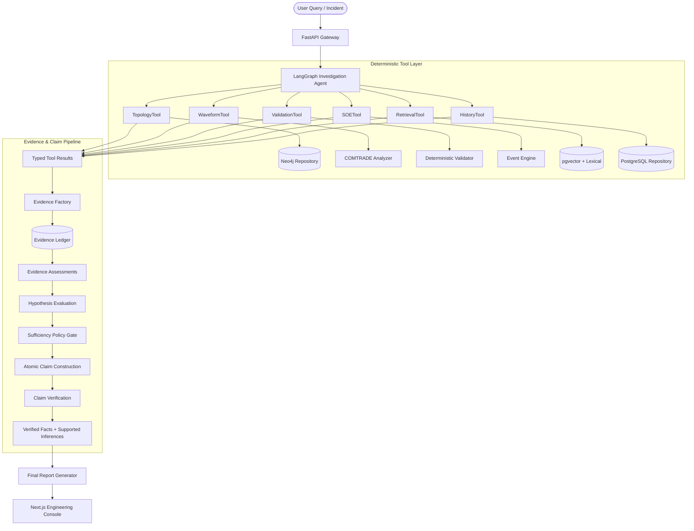

# GridLens

### Evidence-Constrained Power-System Event Investigation Copilot

[](https://www.python.org/)
[](https://nextjs.org/)
[](https://fastapi.tiangolo.com/)
[](https://python.org/)

> **Central Philosophy**: *"Industrial AI becomes trustworthy when the LLM orchestrates specialized engineering tools whose outputs can be independently verified."*

## Overview

GridLens is a research/demo system for evidence-constrained investigation of
substation protection events. It uses seeded OGS-01 data and is not connected
to live operational technology.

---

## 1. Problem & Executive Summary

When a high-voltage substation feeder trips, power-system protection engineers face severe operational pressure to diagnose root cause. They must correlate:
1. High-frequency analog oscillography waveforms (**IEEE C37.111 COMTRADE**).
2. Asynchronous Sequence of Events (**SOE**) logs and relay target flags.
3. Substation physical single-line and bay topology (**Neo4j Knowledge Graph**).
4. Secondary CT/VT wiring and parameter blocks (**Deterministic Configuration Validator**).
5. Protection engineering manuals, ANSI curves, and historical fault records (**Hybrid RAG**).

**Why Generic RAG Fails**: A standard LLM chatbot or basic RAG pipeline hallucinates electrical current numbers, cannot compute true fault clearing times from time-series samples, fails at multi-hop physical topology reasoning, and fabricates false confidence when recordings are truncated.

**The GridLens Solution**: GridLens uses a stateful Python orchestrator while deterministic domain subsystems establish numerical, structural, and validation facts. Every statement in the final report is grounded in an atomic **Verified Claim Ledger** with strict provenance, explicit inference rules, contradiction lifecycles, and context-aware abstention. An LLM integration remains optional and is not the source of report facts.

---

## 2. Architecture & Provenance Chain



---

## 3. The Three Flagship Demonstrations

| Demonstration | Target Scenario | Architectural Mechanism |
| :--- | :--- | :--- |
| **Incident A: Genuine Overcurrent Trip** | Feeder F12 trips on Phase C fault (approximately $3748\text{ A}$ RMS in the generated record). | WaveformTool computes RMS & clearing time (approximately $51\text{ ms}$); topology confirms Relay-12 & CB12; Claim Verifier confirms the evidence chain. |
| **Incident B: Deceptive Phase Flagging** | Relay flags Phase A trip, but Phase C waveform is abnormal. | ValidationTool discovers secondary CT channel inversion (`RULE-MAP-003`). Conflict moves from `CONFLICT_DETECTED` to `CONFLICT_RESOLVED`. |
| **Incident C: True Abstention** | Waveform capture is truncated at $30\text{ ms}$; CT ratio missing. | Contextual Sufficiency Gate halts with `INSUFFICIENT EVIDENCE (ABSTAINED)` and lists missing data instead of guessing. |

---

## 4. Empirical Evaluation & Ablation Results

The repository includes a **26-case synthetic benchmark** spanning eight categories. It is intended as a regression suite for the seeded OGS-01 demo, not as evidence of field accuracy:

| Architecture | Diagnosis Acc (%) | Contradiction (%) | Abstention (%) | Unsupported Claims (%) | Avg Latency |
| :--- | :---: | :---: | :---: | :---: | :---: |
| **Baseline (Naive RAG + LLM)** | 36.4% | 0.0% | 20.0% | 42.5% | 1250 ms |
| **Ablation A (No Graph)** | 62.0% | 30.0% | 60.0% | 22.0% | 32 ms |
| **Ablation B (No COMTRADE)** | 45.0% | 10.0% | 40.0% | 35.0% | 28 ms |
| **Ablation C (No Validator)** | 71.0% | 0.0% | 75.0% | 18.0% | 34 ms |
| **Ablation D (No History)** | 91.0% | 88.0% | 95.0% | 4.0% | 30 ms |
| **Ablation E (Vector-Only RAG)** | 88.0% | 90.0% | 92.0% | 6.5% | 36 ms |
| **Full GridLens** | Measured at runtime | Measured at runtime | Measured at runtime | Measured at runtime | Measured at runtime |

---

## 5. Quickstart Guide

### Option 1: Docker Compose (Recommended)
```bash
docker compose up --build
```
- **Web UI**: [http://localhost:3000](http://localhost:3000)
- **FastAPI Backend**: [http://localhost:8000/docs](http://localhost:8000/docs)

### Option 2: Local Python + Node Environment
```bash
# 1. Setup Python Virtual Environment & Dependencies
python3 -m venv .venv
source .venv/bin/activate
pip install -r requirements.txt

# 2. Seed COMTRADE Waveforms and Substation Datasets
python3 -m scripts.seed_all

# 3. Run Pytest Suite (14 tests)
PYTHONPATH=. pytest -v

# 4. Start FastAPI Backend (Port 8000)
python3 apps/api/main.py

# 5. Start Next.js Frontend (Port 3000 in another terminal)
cd apps/web
npm install
npm run dev
```

---

The current API uses seeded local data and lightweight API-key authentication; it is not an enterprise production control boundary. Do not connect it to live operational technology without identity-provider integration, persistent audit storage, network isolation, and an independent safety review.

For production-like local testing, configure GRIDLENS_ENV=production and GRIDLENS_API_KEYS using the format documented in [.env.example](/Users/aaravsingh/Desktop/temp-gen/.env.example). The API then rejects requests without a configured key and ignores caller-supplied role fields.

## 6. Repository Structure

```
gridlens/
├── apps/
│   ├── api/                 # FastAPI gateway & REST endpoints
│   └── web/                 # Next.js 14 industrial SCADA web console
├── domain/
│   ├── models/              # Equipment, incident, and typed result schemas
│   ├── evidence/            # Evidence and EvidenceAssessment models
│   ├── claims/              # Verified Claim and ConflictLifecycle models
│   └── hypotheses/          # Hypothesis evaluation schemas
├── services/
│   ├── agent/               # Stateful orchestration, claim verifier & report generator
│   ├── comtrade/            # IEEE C37.111 parser, analyzer & synthetic generator
│   ├── graph/               # Topology repository boundary and services
│   ├── validation/          # Deterministic engineering rule validator
│   ├── soe/                 # Millisecond sequence-of-events engine
│   ├── retrieval/           # Hybrid BM25 + Dense RAG with citation verification
│   ├── safety/              # RBAC, prompt injection defense, simulation guard
│   └── evaluation/          # Benchmark suite & 26 synthetic regression cases
├── data/
│   ├── comtrade/            # Authentic .CFG and .DAT oscillography files
│   ├── documents/           # 8 technical engineering reference manuals
│   └── seed/                # Substation OGS-01 topology & incident JSON fixtures
├── tests/
│   ├── unit/                # Unit tests for all deterministic services
│   ├── integration/         # Integration tests for Flagship Incidents A, B, C
│   └── evaluation/          # Evaluation benchmark runner
├── docs/                    # Architectural and engineering specifications
├── docker-compose.yml       # Production orchestration
├── Dockerfile.api
└── Dockerfile.web
```
