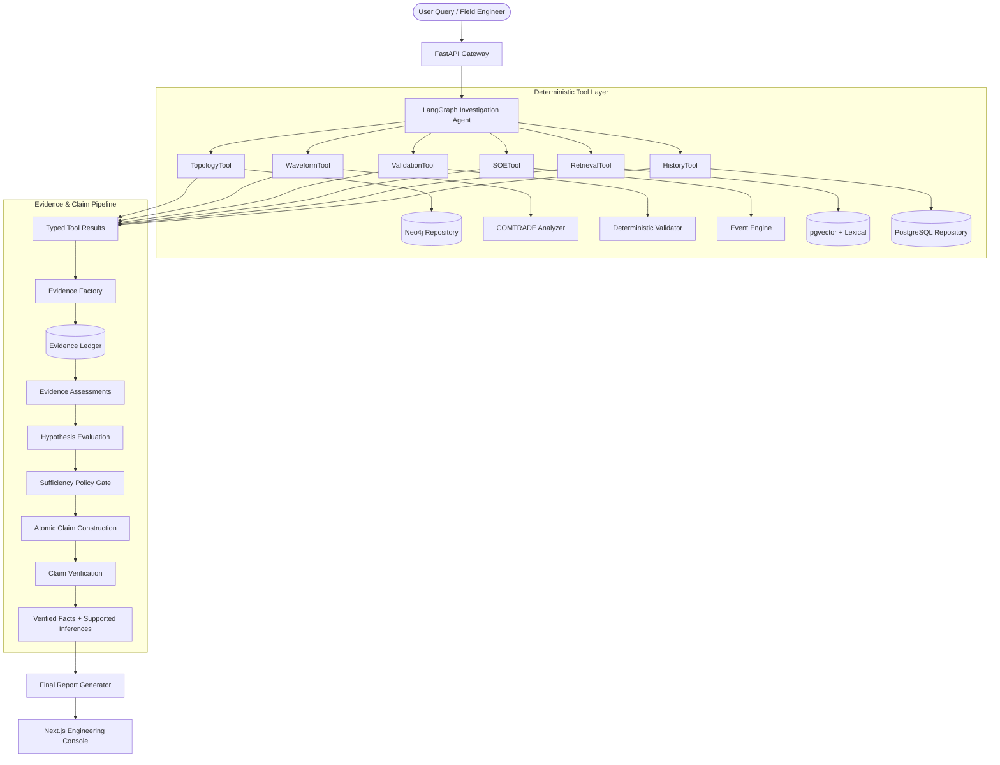

# GridLens System Architecture & Engineering Provenance

> **Core Axiom**: *"Industrial AI becomes trustworthy when the LLM orchestrates specialized engineering tools whose outputs can be independently verified."*

---

## 1. High-Level Architecture

GridLens is an **evidence-constrained agentic engineering investigation system** designed for substation protection and control (P&C) event root-cause analysis.

> Implementation status: the current repository uses a deterministic in-memory OGS-01 topology, local Markdown corpus, and seeded incident/COMTRADE files. The compiled LangGraph router and vector-store interface are active; PostgreSQL/pgvector and Neo4j are replaceable production adapters rather than required demo services.

---

## 2. The Six Semantic Layers of Provenance

GridLens enforces a strict provenance chain from raw physics to the final executive narrative:

1. **Layer 1: Authoritative Source**:
   - COMTRADE oscillography files (`.CFG` / `.DAT`)
   - Seeded topology repository (with Neo4j as a future adapter)
   - Configuration parameter blocks
   - Sequence of Events (SOE) logs
   - Technical engineering manuals
2. **Layer 2: Typed Tool Result**:
   - `ComtradeAnalysisResult`, `TopologyQueryResult`, `ValidationResult`, `EventTimelineResult`, `DocumentRetrievalResult`
3. **Layer 3: Evidence Object**:
   - Atomic, immutable factual assertions extracted deterministically from tool outputs (`EV_COMTRADE_RMS_IC`, `EV_TOPO_PRIMARY_RELAY`, `EV_VALIDATION_PASSED`).
4. **Layer 4: Evidence Assessment**:
   - Contextual mapping of how an `Evidence` fact supports, contradicts, or remains neutral toward candidate hypotheses ($H_1 \dots H_6$).
5. **Layer 5: Hypothesis & Candidate Claims**:
   - Hypotheses scored mathematically via assessment weights.
   - Atomic candidate claims strictly categorized into `FACT`, `INFERENCE`, and `RECOMMENDATION`.
6. **Layer 6: Verification & State-Grounded Report**:
   - Deterministic `ClaimVerifier` audits every candidate claim against tool outputs.
   - LLM formats narrative *only* from the verified claim ledger.

---

## 3. Data-Source Boundaries

| Source | Authoritative Responsibility | Deterministic? |
| :--- | :--- | :--- |
| **COMTRADE Analyzer** | Physical signal measurements ($I_{RMS}, V_{RMS}, I_{peak}, \Delta I, \Delta V, \Delta t$, frequency) | Yes (100% Math) |
| **Topology Repository** | Topological connections (feeder bay, primary relay, controlled breaker, CT/VT sensors) | Yes (seeded in-memory store; DB adapter planned) |
| **Rule Validator** | Engineering configuration consistency (CT secondary ratio, phase mapping, pickup thresholds) | Yes (Rule Engine) |
| **SOE Engine** | Millisecond event ordering, breaker contact transition reconciliation | Yes (Time Engine) |
| **Hybrid RAG** | Standard operating procedures, ANSI device curves, commissioning manuals | Probabilistic Retrieval / Exact Chunks |
| **Incident History** | Past recurring faults and previous maintenance notes | Yes (Relational DB) |
| **Language Model** | Optional explanation formatting only | Never a source of truth; deterministic report path is used by default |
